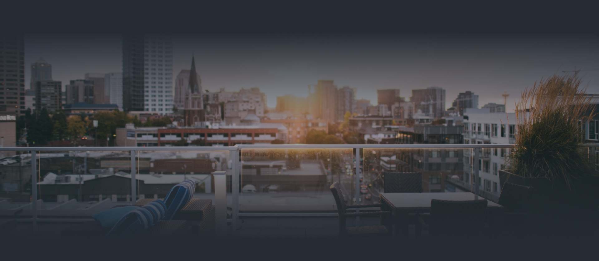
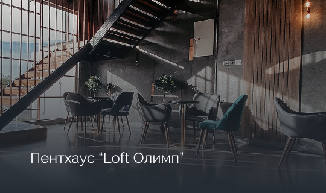
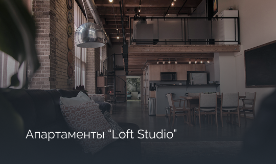
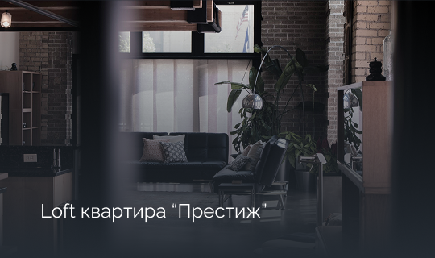
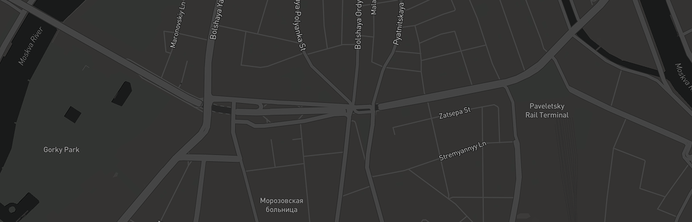

# LoftHouse — Landing Page

**LoftHouse** — это современный лендинг жилого комплекса бизнес-класса, расположенного в историческом центре Санкт-Петербурга.

🌐 [Посмотреть сайт](https://sumaya20011.github.io/Lofthouse/)

---

## 🏢 О проекте

**LoftHouse** — это проект бизнес-класса на Наб. реки Фонтанки 10-15. Комплекс предлагает квартиры площадью от **40 до 170 кв. м**. В здании три секции с общим количеством **56 квартир**.

## 🎨 Дизайн

- Тёмная цветовая палитра с золотыми акцентами (`#D4C17F`)
- Шрифты: **Playfair Display**, **Raleway**, **Roboto**, **Post No Bills Jaffna**
- Минималистичный стиль с плавными анимациями

---

## 📸 Скриншоты

### Главный экран


*Hero-секция с логотипом LoftHouse и навигацией*

### Особенности комплекса

.svg)
- Исторические парки и скверы
- Полностью обустроенная территория
- 10 фонтанов на территории
- 6 км велодорожек

### Квартиры

| Квартира 1 | Квартира 2 |
|---|---|
|  | .png) |

| Квартира 3 | Квартира 4 |
|---|---|
|  |  |

*Галерея квартирры с модальным окном просмотра*

### Район на карте


*Интерактивная карта района*

---

## ⚡ Функционал

### Навигация
- **Якорные ссылки** — плавная прокрутка к секциям
- **Адаптивный хедер** — корректное отображение на всех устройствах

### Галерея квартир
- Модальное окно с плавными анимациями
- Навигация стрелками и клавиатурой (`←`, `→`, `Esc`)
- Поддержка свайпов на мобильных устройствах
- Счётчик изображений

### Видео
- Клик по изображению открывает модальное окно с видеоплеером
- Видео `videohome.mp4` с контролами
- Закрытие по кнопке, клику на фон или `Esc`

### Форма обратной связи
- Поля: имя, телефон
- Валидация и стилизация

### Футер
- Логотип и описание комплекса
- Навигация по разделам
- Ссылки на услуги
- Контактная информация с email (`#D4C17F`)
- Соцсети: YouTube, VK, Facebook, Instagram

---

## 📱 Адаптивность

| Устройство | Размер |
|---|---|
| Desktop | `> 1024px` |
| Tablet | `≤ 1024px` |
| Mobile Landscape | `≤ 768px` |
| Mobile Portrait | `≤ 480px` |

---

## 🛠 Технологии

- **HTML5** — семантическая разметка
- **CSS3** — Flexbox, Grid, анимации, медиа-запросы
- **JavaScript** — модальные окна, галерея, видеоплеер, якорная навигация

---

## 📂 Структура проекта

```
Houmes/
├── index.html          # Главная страница
├── style.css           # Стили
├── img/                # Изображения и видео
│   ├── baground.jpg    # Фон hero-секции
│   ├── 01.png - 04.png # Квартиры
│   ├── map.png         # Карта
│   ├── video.jpg       # Превью видео
│   ├── videohome.mp4   # Видео комплекса
│   └── ...
└── README.md           # Документация
```

---

## 🚀 Запуск

Откройте `index.html` в браузере:

```bash
# macOS
open index.html

# Linux
xdg-open index.html
```

---

## 📞 Контакты

- **Адрес:** Наб. реки Фонтанки 10-15
- **Телефон:** 8 (812) 123-45-67
- **Отдел продаж:** 10:00 - 20:00
- **E-mail:** vip@lofthouse.ru

---

© 2026 LoftHouse. Все права защищены.
